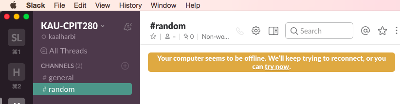
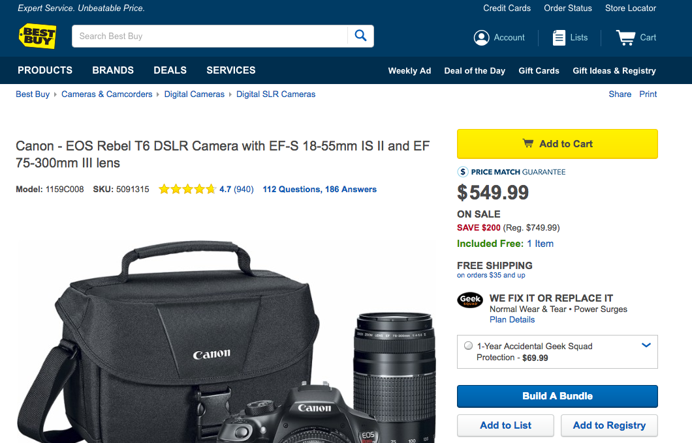
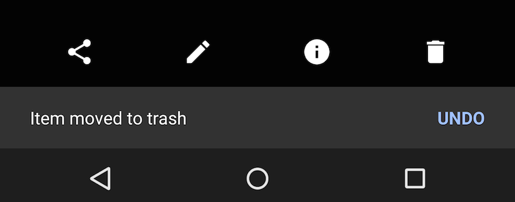
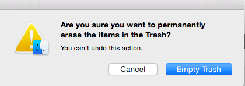
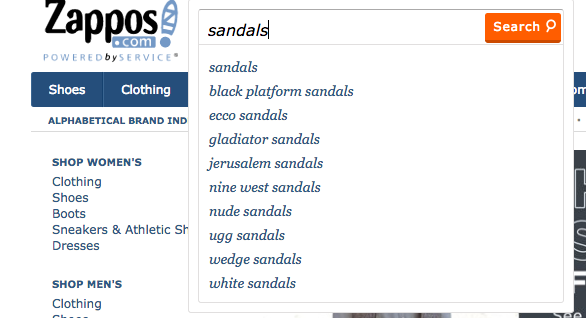
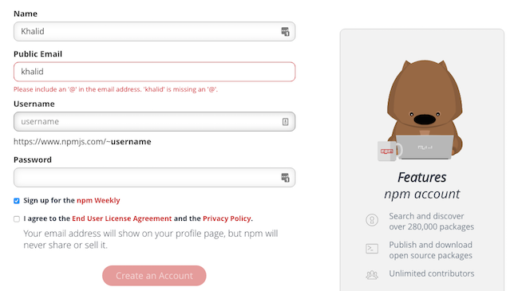

## Usability & User Experience (UX)

## Usability Goals

- Effectiveness <!-- .element: class="fragment" data-fragment-index="0" -->
  - Does it help users achieve their tasks? How good? <!-- .element: class="fragment" data-fragment-index="1" -->
- Efficiency <!-- .element: class="fragment" data-fragment-index="2" -->
  - How many steps are required to achieve a task? <!-- .element: class="fragment" data-fragment-index="3" -->
- Safety <!-- .element: class="fragment" data-fragment-index="4" -->
  - Does it help users avoid serious errors and recover from them? <!-- .element: class="fragment" data-fragment-index="5" -->

## Usability Goals (cont.)
- Utility <!-- .element: class="fragment" data-fragment-index="0" -->
 - Does it provide a set of useful functions? <!-- .element: class="fragment" data-fragment-index="1" -->
- Learnability <!-- .element: class="fragment" data-fragment-index="2" -->
 - Is it easy to learn? Does it require reading the help/docs? <!-- .element: class="fragment" data-fragment-index="3" -->
- Memorability <!-- .element: class="fragment" data-fragment-index="4" -->
  - Is it easy to remember? <!-- .element: class="fragment" data-fragment-index="5" -->

## User Experience (UX) Goals
- Satisfying <!-- .element: class="fragment" data-fragment-index="0" -->
- Enjoyable <!-- .element: class="fragment" data-fragment-index="1" -->
- Fun & Entertaining <!-- .element: class="fragment" data-fragment-index="2" -->
- Helpful <!-- .element: class="fragment" data-fragment-index="3" -->
- Aesthetically pleasing  <!-- .element: class="fragment" data-fragment-index="4" -->

## Norman's Design Principles
- Visibility <!-- .element: class="fragment" data-fragment-index="0" -->
 - What are the controls and how to find them? <!-- .element: class="fragment" data-fragment-index="1" -->
- Feedback <!-- .element: class="fragment" data-fragment-index="2" -->
 - An action requires a reaction <!-- .element: class="fragment" data-fragment-index="3" -->
- Constraints <!-- .element: class="fragment" data-fragment-index="4" -->
 - The limits to user interactions: physical, logical, or cultural constraints  <!-- .element: class="fragment" data-fragment-index="5" -->

## Norman's Design Principles (cont.)
- Mapping <!-- .element: class="fragment" data-fragment-index="6" -->
 - The relationship between the control and the effect <!-- .element: class="fragment" data-fragment-index="7" -->
- Consistency <!-- .element: class="fragment" data-fragment-index="8" -->
 - The same action results in the same reaction all the time <!-- .element: class="fragment" data-fragment-index="9" -->
- Affordance <!-- .element: class="fragment" data-fragment-index="10" -->
 - The relationship between the look and the action <!-- .element: class="fragment" data-fragment-index="11" -->

## Nielsen's 10 Heuristics and Usability Principles 

## 1- Visibility of System Status

## 2- Match between system and the real world
  - Speak the language of your users

  
## 3- User control and freedom

## 4- Consistency and standards
  - Follow platform conventions
  

## 5- Error prevention

## 6- Recognition rather than recall

## 7- Flexibility and efficiency of use

## 8- Aesthetic and minimalist design

## 9- Help users recognize, diagnose, and recover from errors
  - Error messages should be clear, precise, and easy to understand

## 10- Help and documentation
  - Or better yet, work on your design when you find out that users search the documentation to perform a task

## International Standards for HCI and Usability
- Example: International Standards Organization (ISO 9241) <!-- .element: class="fragment" data-fragment-index="0" -->

## Accessibility Guidelines
- Web Content Accessibility Guidelines (WCAG) by W3C <!-- .element: class="fragment" data-fragment-index="0" -->
- Accessibility guidelines for Mobile <!-- .element: class="fragment" data-fragment-index="1" -->

## Any thoughts on the usability of the standards themselves?
- Why aren't they widely adopted? <!-- .element: class="fragment" data-fragment-index="0" -->
- What can we do to increase the usability of UI standards?<!-- .element: class="fragment" data-fragment-index="1" -->
